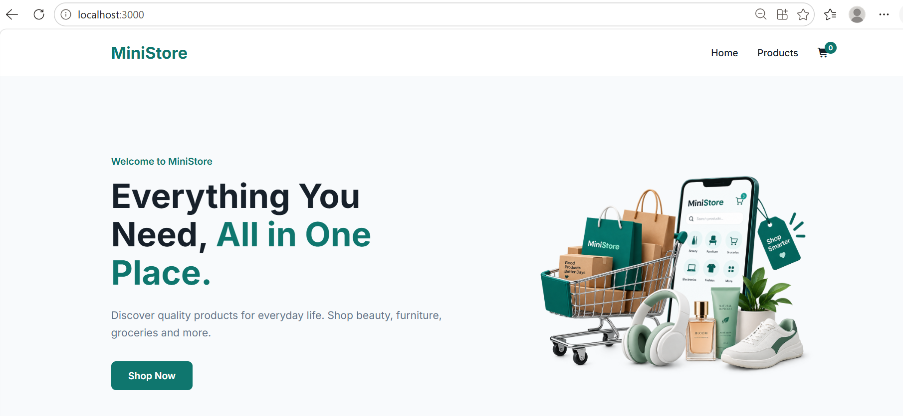
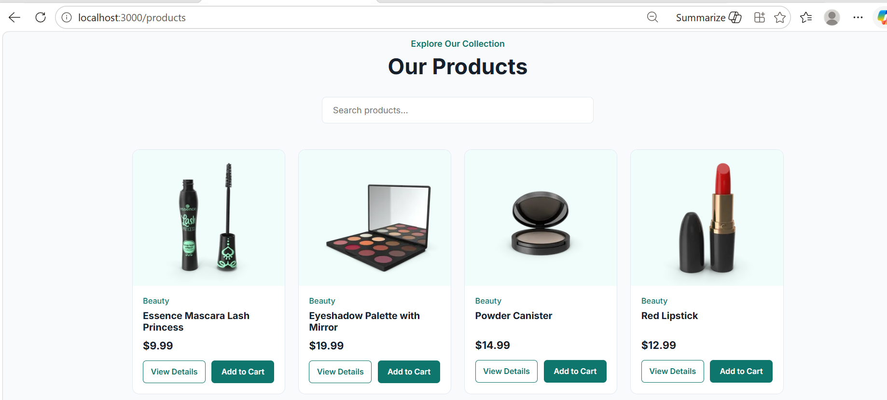
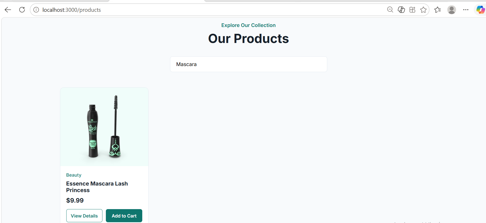
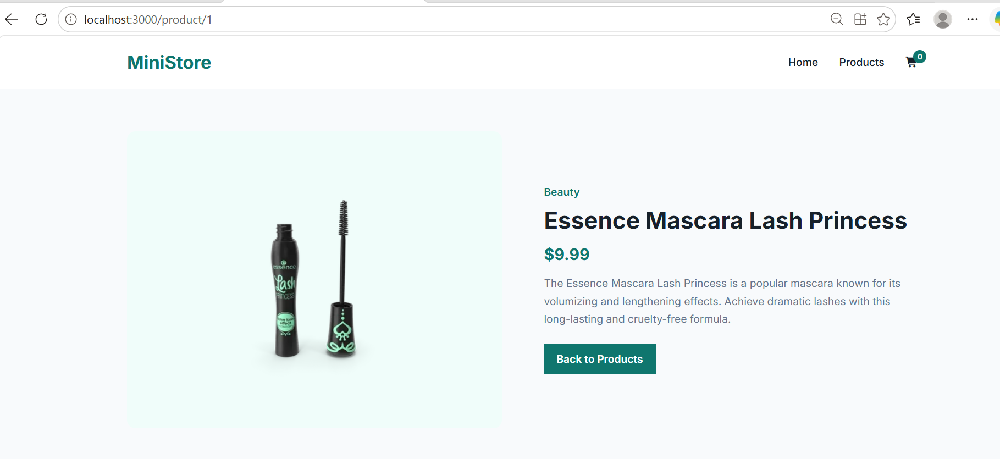
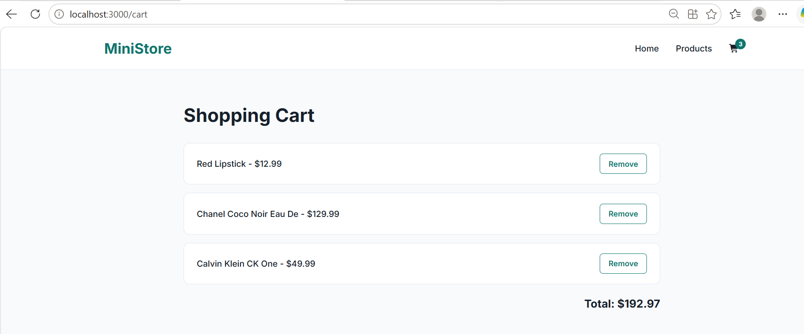

# 🛍️ MiniStore
MiniStore is a React-based product browsing and shopping cart application built as part of my Weeks 1-14 React assessment. The project demonstrates core Reach concepts such as reusable components, React Hooks, client-side routing, API integration, and state management with Redux. Users can browse products fetched from the DummyJSON API, search and filter products, view detailed information about individual products, and, add and remove items from the shopping cart. The application also calculates the total price and includes loading, error, and 404 page handling.


## 📸 Project Preview



## ✨ Features

- Browse products fetched from a public API
- Search and filter products
- View individual product details
- Add products to the shopping cart
- Remove products from the shopping cart
- View the total cart price
- Loading and error handling 
- Responsive and simple user interface


## 🎥 Demo
This short demo showcases the main features of MiniStore, including browsing products, searching and filtering products, viewing individual product details, adding products to the shopping cart, removing items from the cart, and viewing the calculated cart total.
[▶️Watch Demo](./demo/ministore-demo.mp4)


## 🖼️ Screenshots

### Products Page


### Product Search


### Product Details


### Shopping Cart



## ⚒️ Technologies Used

- React.js
- JavaScript (ES6+)
- HTML5
- CSS3
- Redux
- React Redux
- React Router DOM
- DummyJSON REST API
- Font Awesome

## ✅ Assessment Requirements

- Functional React application with reusable components
- React Hooks: useState, useEffect, useRef, and useMemo
- Client-side routing using React Router
- Dynamic product routes using URL parameters
- State management using Redux
- API data fetching using Fetch API
- Product search and filtering
- Shopping cart with add and remove functionality
- Cart total calculation
- Loading and error handling
- 404 page for invalid routes


## 📁 Project Structure

```text
mini-product-store/
├── demo/
│   ├── ministore-demo.mp4
├── public/
│   ├── favicon.ico
│   ├── index.html
│   ├── logo192.png
│   ├── logo512.png
│   ├── manifest.json
│   └──robots.txt
├── screenshots/
│   ├── cart.png
│   ├── home.png
│   ├── product-details.png
│   ├── products.png
│   └──search.png 
├── src/
│   ├── assests/
│   │   └── mini-store-hero-image.png
│   ├── components/
│   │   ├── Cart.js
│   │   ├── Home.js
│   │   ├── Navbar.js
│   │   ├── NotFound.js
│   │   ├── ProductCard.js
│   │   ├── ProductDetail.js
│   │   └── Products.js
│   ├── store/  
│   │   └── redux-store.js
│   ├── App.css
│   ├── App.js
│   ├── App.test.js
│   ├── index.css
│   ├── index.js
│   ├── logo.svg
│   ├── reportWebVitals.js
│   └──setupTests.js
├── .gitignore
├── package-lock.json
├── package.json
└── README.md
```

## 🚀 Getting Started

### 1. Clone the repository
``` \bash
git clone https://github.com/ManyataDhakal/mini-product-store.git
```

### 2. Go to the project folder
```bash
cd mini-product-store
```

### 3. Install dependencies
```bash
npm install
```

### 4. Start the application
```bash
npm start
```
